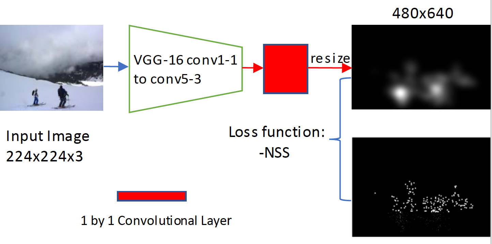
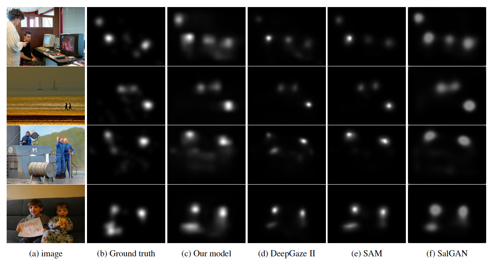
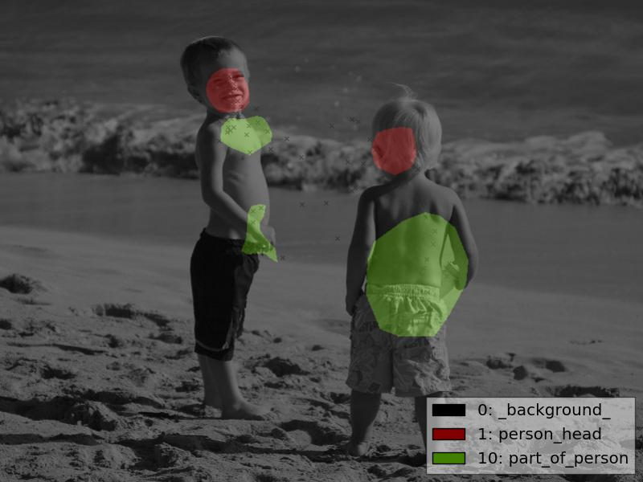
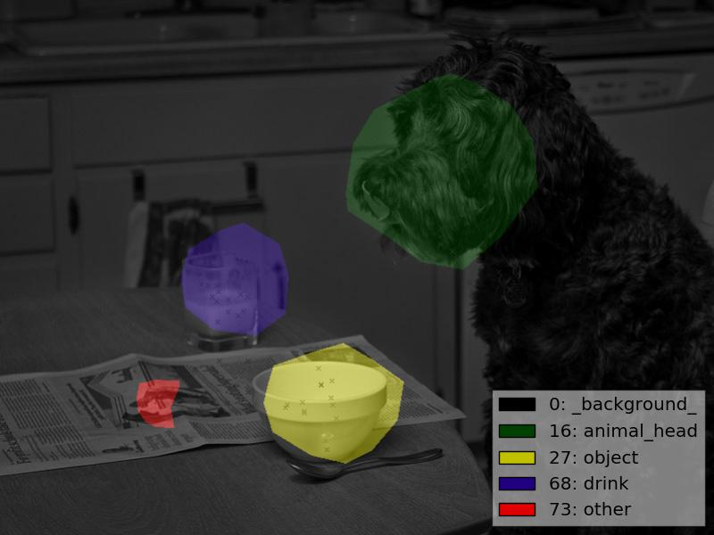
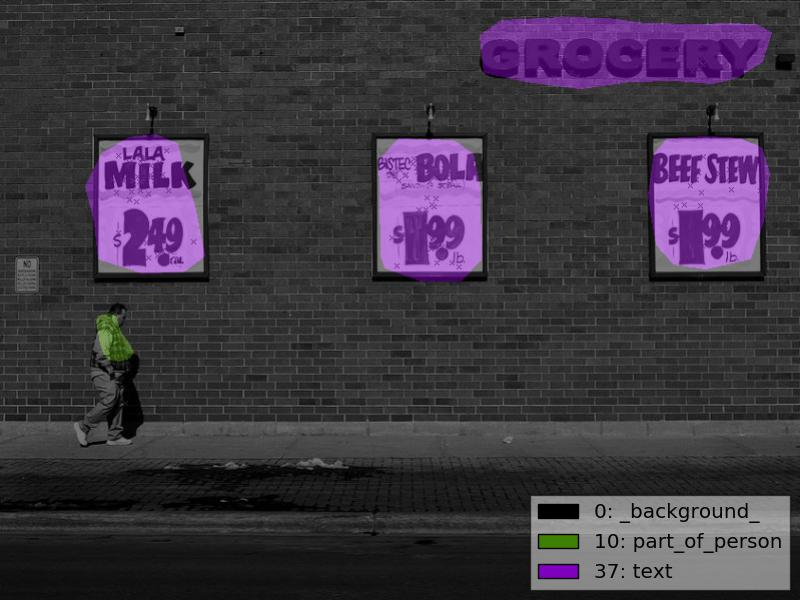
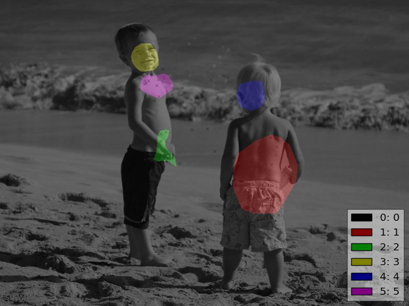
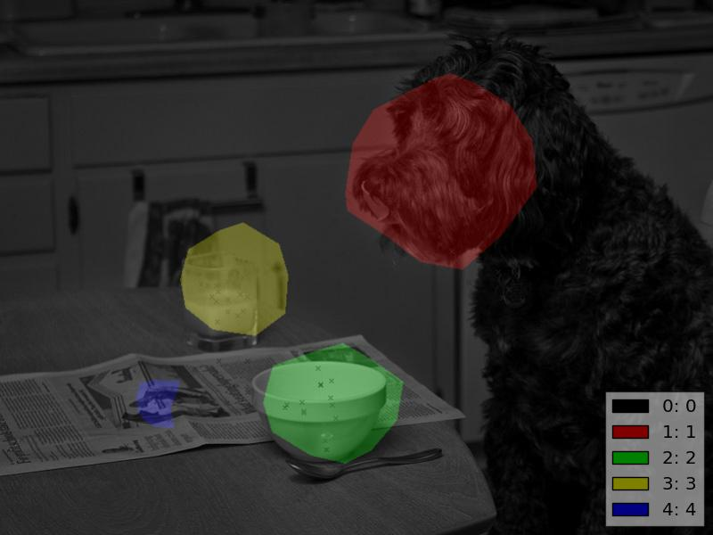
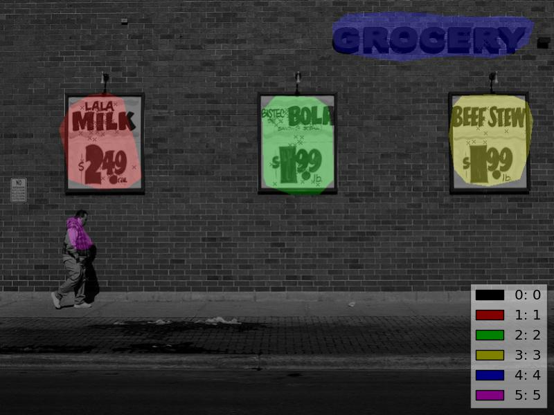

# Understanding-and-Visualizing-Deep-Visual-Saliency-Models-cvpr-2019
## Introduction
This is the demo of code, model and methods used in my CVPR 2019 paper ([link](https://arxiv.org/abs/1903.02501)).
There are some differences between the model used in the paper and this repository, the model used in the paper is implemented in Tensorflow and the model in this repository is implemented in Pytorch(0.4.1), if you are interested in this work, please run the demo.ipynb in jupyter notebbok to see the model and methods.
## The Model Architecture:

The model is trained on [Salicon database](http://salicon.net).  
Some saliency prediction examples on OSIE data  

## Data and annotation
### Data annotation
All the data annotation is done by myself using [labelme](https://github.com/wkentaro/labelme)
### Data link
[synthetic_data](https://drive.google.com/drive/folders/1wrdG1O5WgGl_ReoX5VGLKtroCuvzx2tv?usp=sharing)  
[OSIE-SR](https://drive.google.com/open?id=15iWBfNwktSq6KsNtAU1KRn0N3kVSOWHh)  
The SegmentationClass folder contains the semantic level masks for each salient regions in the image,and the SegmentationObject folder contains the instance level masks for each salient regions in the image.  
### Indexing in semantic mask
1:person head, 10:person part, 16:animal head, 22:animal part, 27:object, 37:text, 46:symbol, 51:vehicle, 57: food, 63:plant, 68:drink, 73:other
### Some data examples:  
  

